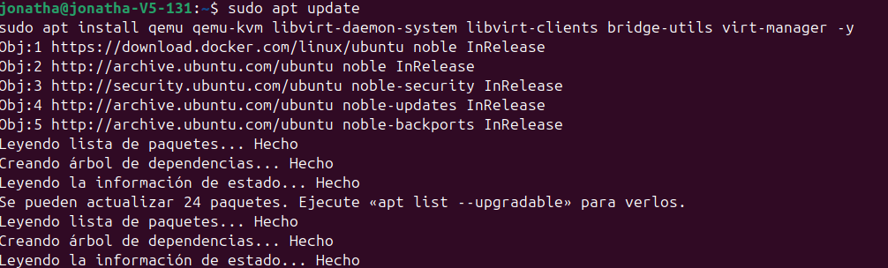
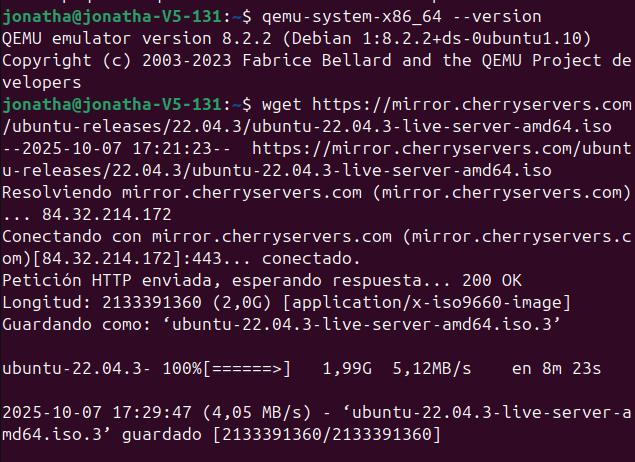
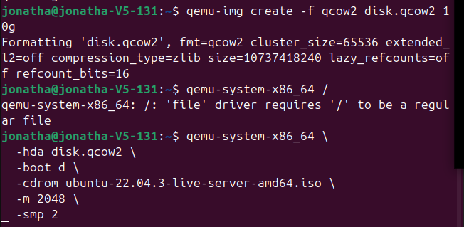
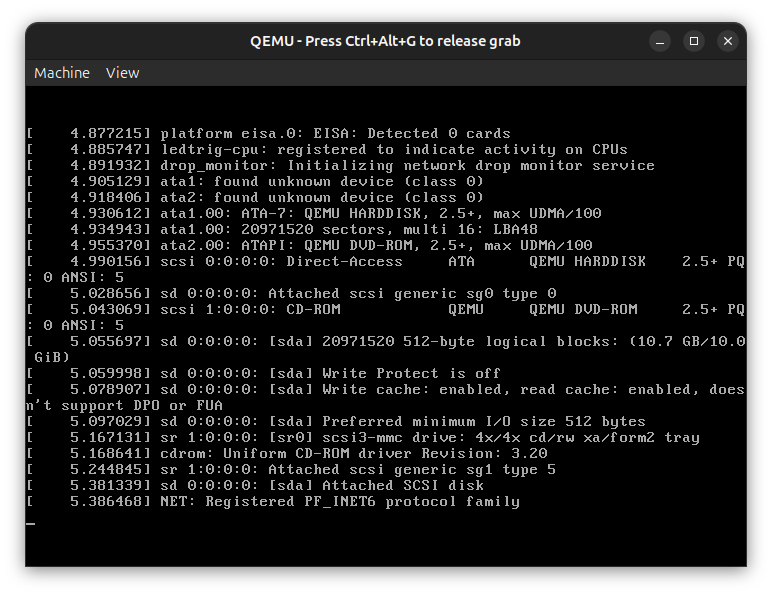

# Tarea 5 – Sistemas Operativos y Virtualización

Este proyecto incluye:
1. Investigación de distintas distribuciones Linux.
2. Uso de QEMU como emulador y virtualizador.
3. Análisis de red con Nmap.

Autor: Jonathan Diaz
Fecha: Octubre 2025
Materia: Digiales III
# 🧩 Punto 1 – Investigación sobre los sistemas operativos

A continuación se presenta la información correspondiente a los sistemas operativos solicitados, incluyendo su historia, características, usos y aplicaciones.

---

## 🟢 Debian
**Historia:** Nació en 1993, creado por Ian Murdock. Es una de las distribuciones más antiguas y estables de Linux.  
**Características:** Estabilidad, seguridad, gran comunidad, soporte de software libre.  
**Uso:** Servidores, estaciones de trabajo, entornos educativos.  
**Aplicaciones:** Base de otras distribuciones como Ubuntu y Kali Linux.

---

## 🟠 Arch Linux
**Historia:** Lanzado en 2002 por Judd Vinet.  
**Características:** Sistema minimalista, rolling release, alta personalización, gestor de paquetes *pacman*.  
**Uso:** Usuarios avanzados que desean controlar cada componente del sistema.  
**Aplicaciones:** Desarrollo, pruebas, entornos personalizados.

---

## 🟣 Rocky Linux
**Historia:** Surge en 2021 como reemplazo de CentOS, liderado por Gregory Kurtzer (fundador de CentOS).  
**Características:** Compatible binariamente con Red Hat Enterprise Linux (RHEL).  
**Uso:** Servidores empresariales y entornos de producción.  
**Aplicaciones:** Hosting, bases de datos, servicios web.

---

## 🔵 Garuda Linux
**Historia:** Distribución moderna basada en Arch Linux, lanzada en 2020.  
**Características:** Interfaz atractiva, optimizada para juegos, rendimiento y facilidad de uso.  
**Uso:** Usuarios de escritorio, gamers y entusiastas de Linux.  
**Aplicaciones:** Juegos, multimedia, personalización.

---

## 🔴 Fedora
**Historia:** Creada por Red Hat en 2003 como distribución comunitaria.  
**Características:** Innovadora, actualizaciones rápidas, base para RHEL.  
**Uso:** Desarrolladores, usuarios que buscan las últimas versiones.  
**Aplicaciones:** Desarrollo de software, pruebas de tecnologías Red Hat.

---

## 🟢 Manjaro
**Historia:** Basada en Arch Linux, creada en 2011.  
**Características:** Instalación sencilla, entorno amigable, compatibilidad con AUR.  
**Uso:** Escritorios de usuario medio y avanzado.  
**Aplicaciones:** Uso diario, desarrollo, multimedia.

---

## 🟣 CentOS
**Historia:** Nació en 2004 como versión gratuita de RHEL; en 2020 pasó a CentOS Stream.  
**Características:** Estabilidad, soporte empresarial, enfoque en servidores.  
**Uso:** Servidores web, hosting, entornos de red.  
**Aplicaciones:** Aplicaciones empresariales, sistemas de bases de datos.

---

## ⚫ Kali Linux
**Historia:** Derivado de Debian, lanzado en 2013 por Offensive Security.  
**Características:** Incluye herramientas de pentesting, hacking ético y seguridad informática.  
**Uso:** Auditorías de seguridad, análisis forense, ciberseguridad.  
**Aplicaciones:** Nmap, Metasploit, Wireshark, Burp Suite, John the Ripper.

---

## 🟢 Linux Mint
**Historia:** Creada en 2006, basada en Ubuntu/Debian.  
**Características:** Fácil de usar, estable, interfaz amigable (Cinnamon, MATE).  
**Uso:** Escritorio doméstico y educativo.  
**Aplicaciones:** Navegación, ofimática, multimedia.

---

## 🟠 Ubuntu
**Historia:** Creada en 2004 por Canonical Ltd., basada en Debian.  
**Características:** Popular, soporte a largo plazo (LTS), amplia comunidad.  
**Uso:** Escritorio, servidores, nube.  
**Aplicaciones:** Uso general, servidores web, educación, IoT.

---

## ⚪ Alpine Linux
**Historia:** Distribución ligera creada en 2005.  
**Características:** Seguridad, tamaño reducido, uso de *musl* y *busybox*.  
**Uso:** Contenedores (Docker), routers, sistemas embebidos.  
**Aplicaciones:** Entornos minimalistas, microservicios, infraestructura en la nube.

---

## 🟤 AlmaLinux
**Historia:** Surgió en 2021 tras el fin de CentOS clásico. Desarrollado por CloudLinux.  
**Características:** Binariamente compatible con RHEL, estable y comunitario.  
**Uso:** Entornos empresariales, servidores.  
**Aplicaciones:** Hosting, bases de datos, entornos corporativos.

---

# 💻 Punto 2 – Instalación y uso de QEMU

## 🧠 ¿Qué es QEMU?

**QEMU (Quick EMUlator)** es un software libre que permite **emular y virtualizar sistemas operativos**.  
Funciona ejecutando máquinas virtuales que pueden correr distintos sistemas, como Debian, Fedora, Ubuntu, entre otros, dentro del mismo computador físico.

- **Tipo de herramienta:** Emulador y virtualizador.  
- **Compatibilidad:** Linux, Windows y macOS.  
- **Usos comunes:**  
  - Laboratorios virtuales de redes o sistemas operativos.  
  - Pruebas de software sin alterar el sistema principal.  
  - Simulación de arquitecturas diferentes (x86, ARM, RISC-V, etc.).

---
## ⚙️ Instalación de QEMU en Linux

### 🔹 Paso 1: Actualizar el sistema
Antes de instalar, es importante tener el sistema actualizado:
-sudo apt update && sudo apt upgrade -y

### 🔹 Paso 2: Instalar QEMU y herramientas relacionadas
-sudo apt install qemu qemu-kvm libvirt-daemon-system libvirt-clients bridge-utils virt-manager -y
### 🔹 Paso 3: Verificar instalación
-qemu-system-x86_64 --version

### 🔹 Paso 4: Crear una imagen de disco virtual
-qemu-img create -f qcow2 mi_disco.qcow2 10G

### 🔹 Paso 5: Iniciar la máquina virtual
-qemu-system-x86_64 -hda mi_disco.qcow2 -cdrom debian.iso -boot d -m 2048

